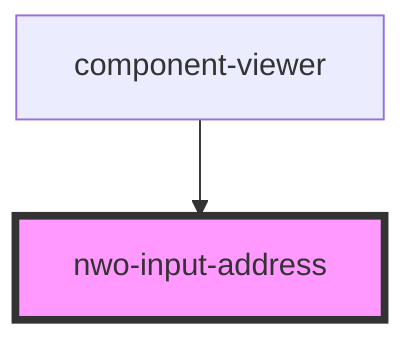

# nwo-input-address

<!-- Auto Generated Below -->

## Properties

| Property      | Attribute     | Description | Type      | Default              |
| ------------- | ------------- | ----------- | --------- | -------------------- |
| `city`        | `city`        |             | `string`  | `undefined`          |
| `country`     | `country`     |             | `string`  | `undefined`          |
| `label`       | `label`       |             | `string`  | `'Enter Address'`    |
| `placeholder` | `placeholder` |             | `string`  | `'Enter Address...'` |
| `required`    | `required`    |             | `boolean` | `true`               |
| `state`       | `state`       |             | `string`  | `undefined`          |
| `street`      | `street`      |             | `string`  | `undefined`          |
| `zip`         | `zip`         |             | `string`  | `undefined`          |

## Events

| Event     | Description | Type               |
| --------- | ----------- | ------------------ |
| `changed` |             | `CustomEvent<any>` |

## Dependencies

### Used by

 - [component-viewer](../component-viewer)

### Graph

----------------------------------------------

*Built with [StencilJS](https://stenciljs.com/)*
